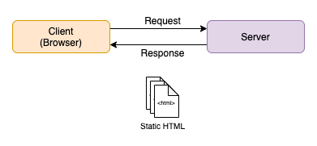
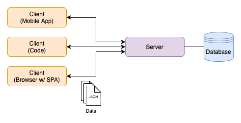
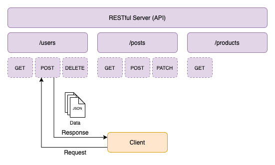

# 1: What is a RESTful API?

## Traditional Web Apps

**Process Flow**:

- Client submits a Request
- Server processes the Request
- Server returns a Response
- Response contains Static HTML
- Client renders HTML

## Modern Web Apps

**Process Flow**:

- Client submits a Request
- Server processes the Request
- Server fetches data from database (*optional, but typical*)
- Server returns a Response
- Response contains Data (*typically in JSON format*)
- Client processes Data and re-renders HTML (*typically via JavaScript*)

## RESTful API

**API**: A Server with a set of URLs that support different types of HTTP Requests in order to facilitate data transfer

**REST**: **Re**presentational **S**tate **T**ransfer

**Process Flow**:

- Client submits a Request
- Server processes the Request
- Server fetches data from database (*optional, but typical*)
- Server returns a Response
- Response contains Data (*typically in JSON format*)
- Client processes Data and re-renders HTML (*typically via JavaScript*)

### RESTful Constraints

1. Client-Server Architecture
    - Separation of concerns
    - RESTful API should not care about the UI
2. Stateless
    - No Client-Context (e.g. Session) is stored on the Server
3. Cacheability
    - Responses must define themselves as cacheable or non-cacheable
4. Layered System
    - Intermediate Servers may be used without the Client knowing about it
5. Uniform Interface
    - Resources are identified in Requests
    - Transferred data can be decoupled from the database schema
    - Self-descriptive Messages
    - Links to further resources (*optional*)
        - **E.g.**: Each `User` from the Response for GET `/users` includes a property that contains the API route to get to the individual `User`
6. Code on Demand (*optional*)
    - Executable Code could be transferred

[< back](../../README.md)
