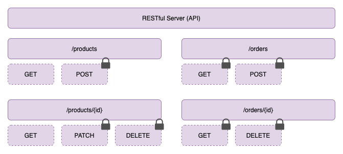

# 2: Planning & First Steps

## What We'll Build



- Padlock icon denotes a protected route that requires the Requestor to be authenticated

## Setup

Initialize `npm`:

```
$ npm init
```

Install Express.js:

```
$ npm i --save express
```

[< back](../../README.md)
